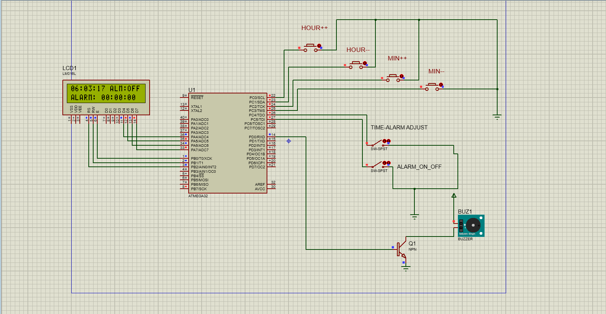

# ATmega32 Alarm Clock Project

This is a simple alarm clock project implemented on the ATmega32 microcontroller. The project features a real-time clock (RTC), adjustable alarm time, and a buzzer for alarm notification. It uses a 16x2 LCD to display the current time and alarm status.

## Table of Contents
- [Introduction](#introduction)
- [Features](#features)
- [Hardware Requirements](#hardware-requirements)
- [Project Structure](#project-structure)
- [Getting Started](#getting-started)
- [Usage](#usage)
- [Contributing](#contributing)
- [License](#license)

## Introduction

This project demonstrates the use of an ATmega32 microcontroller to create a digital alarm clock. The system includes features such as time adjustment, alarm activation/deactivation, and a buzzer for alarms. The project is written in C and can serve as a foundation for more advanced embedded systems.

### Project Image

## Features

- Real-time clock (RTC) functionality.
- Adjustable time with hour and minute increments.
- Alarm activation and deactivation.
- Audible alarm notification using a buzzer.
- 16x2 LCD display for time and alarm status.

## Hardware Requirements

To replicate this project, you will need the following hardware components:

- ATmega32 microcontroller.
- 16x2 LCD display.
- Push buttons (for time and alarm adjustment).
- Buzzer for audio alerts.
- Appropriate power supply.
- Required resistors, capacitors, and connecting wires.

## Project Structure

The project is organized into several files:

- `main.c`: The main application code that initializes the components and handles user interaction.
- `application.c` and `application.h`: Functions and definitions specific to the alarm clock application.
- `LCD_Interface.h`: Library for interfacing with the LCD.
- `TIMERS_Interface.h` and `TIMERS_Private.h`: Timer-related libraries for managing time and alarms.
- `STD_Types.h` and `bit_calc.h`: Standard types and bit manipulation functions.

## Getting Started
- Use the push buttons to adjust the time and set the alarm.
- Press the "ALARM ON/OFF" button to activate or deactivate the alarm.
- The LCD display will show the current time and alarm status.
When the alarm time matches the current time, the buzzer will sound.
## Contributing
Contributions to this project are welcome! If you have any improvements, bug fixes, or new features to add, please submit a pull request.

## License
This project is licensed under the MIT License - see the LICENSE file for details.